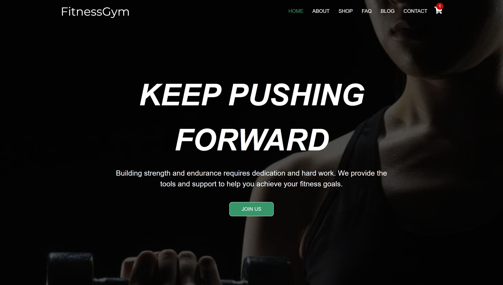

# 🏋️ FitnessGym Website (React, JavaScript, SCSS)

> **Case:** Build a modern and fully responsive fitness website offering dynamic features such as a product shop, trainer profiles, gym services, and interactive schedules. Deliver an engaging platform for fitness enthusiasts.

> **Tech Stack:** `React`, `JavaScript (ES6+)`, `CSS3`, `SCSS/SASS`, `Git`.

---

## 🚀 Usage

### Running the Project Locally

- Clone the repository:

```bash
git clone https://github.com/dawidolko/FitnessGym-Website.git
cd FitnessGym-Website
```

- Install project dependencies:

```bash
npm install
```

- Start the development server:

```bash
npm start
```

- Open the application in your browser at [http://localhost:3000](http://localhost:3000)

---

## 📈 Features

- **Interactive Product Shop:**
  - Browse a range of fitness supplements: proteins, creatine, pre-workouts.
  - View detailed product descriptions, pricing, and images.
  - Add products dynamically to the shopping cart.

- **Gym Services Section:**
  - Explore gym facilities, available classes, and detailed schedules.
  - Browse trainers' profiles, showcasing their specialties and certifications.

- **Responsive Design:**
  - Optimized for a flawless experience across mobile, tablet, and desktop devices.

- **Dynamic Frontend:**
  - Search functionality, product category filters, and interactive UI components.

- **Aesthetic & Modular UI:**
  - Clean, reusable SCSS/SASS structure for scalable styling and theming.

---

## 🧠 Technologies

- **React** – Component-based dynamic frontend architecture.
- **JavaScript (ES6+)** – Logic for interactivity and dynamic behaviors.
- **SCSS / SASS** – Structured and reusable CSS styling.
- **Git** – Version control and project collaboration.

---

## 📂 Project Structure

```plaintext
FitnessGym-Website/
├── public/            # Static public files
├── src/
│   ├── assets/        # Images and media
│   ├── components/    # Reusable React components
│   ├── pages/         # Main page components (Home, Shop, Trainers, etc.)
│   ├── styles/        # Global and modular SCSS styles
│   └── App.js         # Main application entry point
├── package.json       # Project dependencies and metadata
└── README.md          # Project documentation
```

---

## 🖼️ Screenshots

[](src/assets/fitnessgym.dawidolko.pl_.png)

---

## 🌍 Availability

The project is deployed and available at:  
[**https://fitnessgym.dawidolko.pl**](https://fitnessgym.dawidolko.pl)

---

## 📜 License

The **FitnessGym** project is licensed under the [MIT License](LICENSE).

---

## 🙋‍♂️ Author

Created by **Dawid Olko**  
> Part of the **FitnessGym** project series.

---
